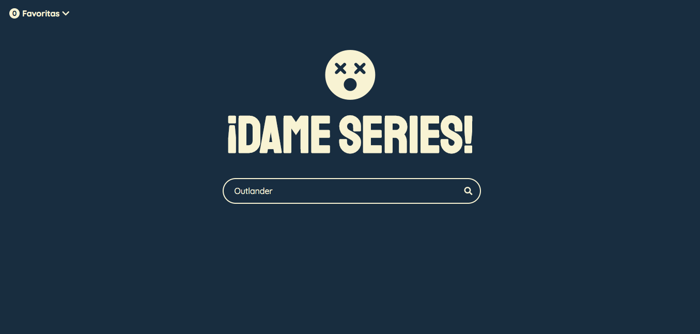
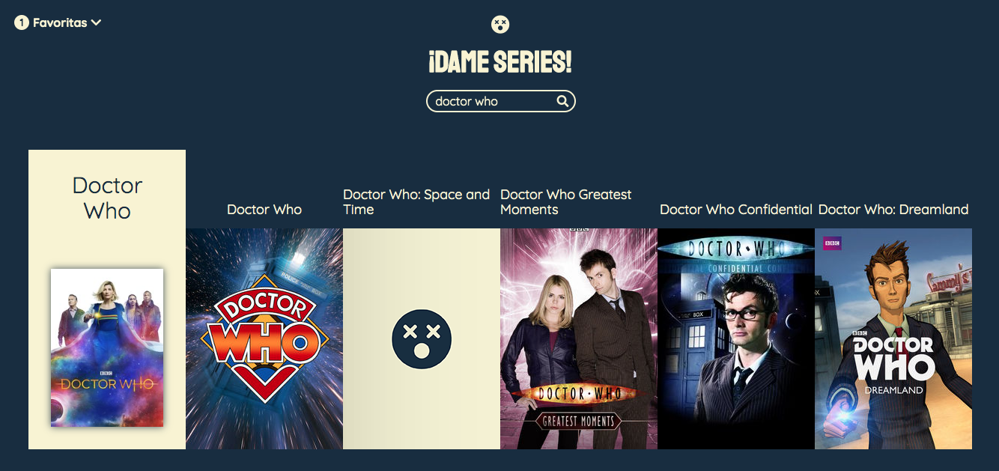
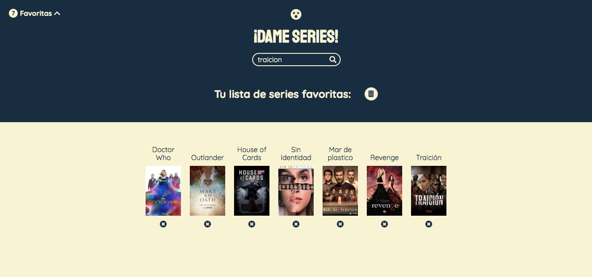

# Buscador de Series.
### *Show Search*.



This is the proposal I developed for one of the tests we had at [Adalab](https://adalab.es/). We had to make a simple app to search tv shows so the user could also select their favourites and add them to a list. The user's favourite shows had to be locally stored so they would remain in the list on future visits to the site.
I used html, sass and javascript partials compiled with node/gulp.




### Getting started

If you want to play around with my project, please visit [my Github repository](https://github.com/marianalfr/buscador-de-series) to clone or download it.
* To clone it: copy this [link](https://github.com/marianalfr/buscador-de-series.git) and go to your terminal. Once in the terminal, navigate to the directory where you want to install it and use the command:

```$ git clone https://github.com/marianalfr/buscador-de-series.git```

* To download it: you can download the zip version using the clone or download tab on the repository and unzip it in your local directory.


### Installing

* On your terminal, make sure you are in your *buscador-de-series* folder and run the commands:

`$ npm install`

`$ npm start` or `$ gulp`

* Gulp will create the `public`folder and will run a local server where any changes will immediately show.
* You can also create a `docs`folder by running `gulp docs`on your terminal.


### Technologies

* HTML 5.
* CSS - SCSS.
* Javascript.
* Gulp


### MIT License.

Copyright (c) 2019 Skylabers

Permission is hereby granted, free of charge, to any person obtaining a copy
of this software and associated documentation files (the "Software"), to deal
in the Software without restriction, including without limitation the rights
to use, copy, modify, merge, publish, distribute, sublicense, and/or sell
copies of the Software, and to permit persons to whom the Software is
furnished to do so, subject to the following conditions:

The above copyright notice and this permission notice shall be included in all
copies or substantial portions of the Software.

THE SOFTWARE IS PROVIDED "AS IS", WITHOUT WARRANTY OF ANY KIND, EXPRESS OR
IMPLIED, INCLUDING BUT NOT LIMITED TO THE WARRANTIES OF MERCHANTABILITY,
FITNESS FOR A PARTICULAR PURPOSE AND NONINFRINGEMENT. IN NO EVENT SHALL THE
AUTHORS OR COPYRIGHT HOLDERS BE LIABLE FOR ANY CLAIM, DAMAGES OR OTHER
LIABILITY, WHETHER IN AN ACTION OF CONTRACT, TORT OR OTHERWISE, ARISING FROM,
OUT OF OR IN CONNECTION WITH THE SOFTWARE OR THE USE OR OTHER DEALINGS IN THE
SOFTWARE.


-------

As a base for my project I used my customised *starter kit*:

--------


## Cambios con respecto al Kit de Adalab
- Meta para viewport añadida a `index.html`, **para que funcionen las media queries**.

- `index.html` modificado de tal manera que queda con **3 partials: header, main y footer**. El div con `class="page"` ahora tiene `class="wrapper"`. Cada uno de los partials tiene asignada su respectiva etiqueta en el archivo correspondiente, y tienen asignadas las clases `class="header"`, `class="main"` y `class="footer"` respectivamente.

- `_normalize.scss` **ligeramente ampliada** añadida a la carpeta `_src > assets > scss > vendors`, e incluida en `main.scss.`.

- **Añadidas las carpetas core, layout, components, y pages**, con sus respectivos archivos (vacíos), ya incluidos en `main.scss`. Se han eliminado los archivos _links.scss y _settings.scss por no ser consistentes con lo que se especifica en la teoría que debemos hacer.

- **Función para transformar píxels en rems** añadida al archivo `_functions.scss`. Ejemplo de uso: Si queremos que un título con la clase `.title` tenga un tamaño de fuente de 24px pero traducidos a rem, lo especificaremos de la siguiente manera:
```
.title{
      font-size: rem(24);
}
```

- Para que la función anterior funcione, se ha añadido la variable `$defaultFontSize: 16;` al archivo `_variables.scss`, que ha de tener el mismo valor que el tamaño de fuente por defecto del documento html (especificado también en el archivo `_default.scss`). **Si queremos cambiarlo, debemos hacerlo en ambos lugares**.

- **Variables que establecen los tamaños de pantalla máximos** añadidas al archivo `_variables.scss`. La variable `$tablet` tiene asignado un breakpoint de 768px y la variable `$desktop` un breakpoint de 1200px. Si necesitamos que nuestros breakpoints sean otros, sólo tendremos que cambiar estos valores.

- **Mixin para las media queries** añadido al archivo `_mixins.scss`. Ejemplo de uso: Si queremos añadir media queries a un elemento html con la clase `.main` podremos hacerlo de la siguiente manera, bien usando nuestras variables `$tablet` y `$desktop` definidas anteriormente, o con los breakpoints que necesitemos:
``` 
.main{
      width: 100%;

      @include media($tablet){
            width: 70%;
      }

      @include media($desktop){
            width: 60%;
      }

      @include media (1700px){
            width: 50%;
      }
}
```
- Logo y favicon de adalab eliminados.

----

## Guía de inicio rápido
Necesitarás instalar [Node.js](https://nodejs.org/) y [Gulp](https://gulpjs.com) para trabajar con este Starter Kit, luego:
1. Descarga o clona el repositorio
2. Instala las dependencias locales con `npm install`
3. Arranca el kit con `gulp`

## Espera, ¿esto se hace siempre?
> ### Solo una vez al principio en cada ordenador que utilicemos:
- Instalamos node
- Instalamos el comando de gulp de forma global para poder usarlo desde cualquier carpeta usando `npm install --global gulp-cli`

> ### Cada vez que descarguemos o clonemos un repo:
- `npm install` para instalar los paquetes necesarios para convertir Sass a CSS, minizarlo, etc.

> ### Cada vez que estemos trabajando con nuestro código:
- Desde nuestra terminal, ejecutamos el comando `gulp` para que realice la tarea por defecto, que en el caso del `gulpfile.js` que tenemos en adalab-web-starter-kit estará pendiente de nuestros archivos Sass, html y JavaScript y los compilará, minificará y/o recargará el servidor cada vez que hagamos un cambio

## Tareas de gulp incluidas
### Inicio de un web server para desarrollo
```
npm start
```
o lo que en este proyecto es lo mismo:

```
gulp
```
Lanza un webserver con BrowserSync y varios watchers estarán pendientes de los archivos SCSS/JS/HTML, en la carpeta **public/**, para recargar el navegador cuando se necesite.

### Versión lista para subir a producción

Para generar los ficheros para producción ejecuta:

```
npm run docs
```
o lo que en este proyecto es lo mismo:
```
gulp docs
```
En la carpeta **docs/** se generarán los CSS y JS minimizados y sin sourcemaps listos para subir al repo. A continuación súbelos al repo y activa en GitHub Pages la opción **master/docs/**, para que GitHub Pages sirva la página desde la carpeta **docs/**.

---

Si quieres generar los ficheros listos para producción y además subirlos a GitHub directamente ejecuta el siguiente comando:
```
npm run push-docs
```
Este comando borra la carpeta **docs/**, la vuelve a generar, crea un commit con los nuevos ficheros y hace un `git push`, todo del tirón. ¿Cómo se te queda el cuerpo?. Si quieres saber cómo funciona échale un ojo al fichero `package.json`.

## Flujo de archivos con gulp

Estas tareas de gulp producen el siguiente flujo de archivos:


## Estructura del proyecto
Nuestro **gulpfile.js** usa un JSON de configuración con las rutas de los archivos a generar/vigilar.

La estructura de carpetas tiene esta pinta:
```
/
`- _src
   |- assets
   |  |- icons
   |  |- images
   |  |- js
   |  `- scss
   |     `- core
   |
   `- templates
      `- partials

```

## HTML
Viene incluído el paquete [**gulp-html-partial**](https://www.npmjs.com/package/gulp-html-partial) que nos va a permitir tener un sistema de plantillas html

## Imágenes e iconos
Tenemos en **_src/** una carpeta para las imágenes del proyecto y una para los iconos como el favicon o los iconos de dispositivos móviles. Estos últimos se generan en la raíz de las carpetas **public/** y **docs/**

## CSS
Viene incluído el paquete [**gulp-combine-mq**](https://www.npmjs.com/package/gulp-combine-mq) que agrupa todas las mediaqueries al final del documento css.

## JS
Podemos usar parciales de JS: en el JSON de configuración, **config.json** especificamos los archivos JS que utilizamos y en el orden que deben procesarse.

## ¿Cómo actualizo si tengo una versión anterior?
En principio puedes descargar todos los archivos fuera de **_src/** y sustituir los de tu proyecto. Además deberías replicar la estructura de carpetas dentro de **_src/**.

## ¿Falta algo?
¿Echas de menos que el kit haga algo en concreto? Pidelo sin problema a través de los Issues o si te animas a mejorarlo mándanos un PR :)
